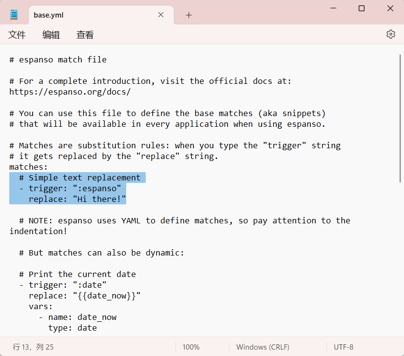
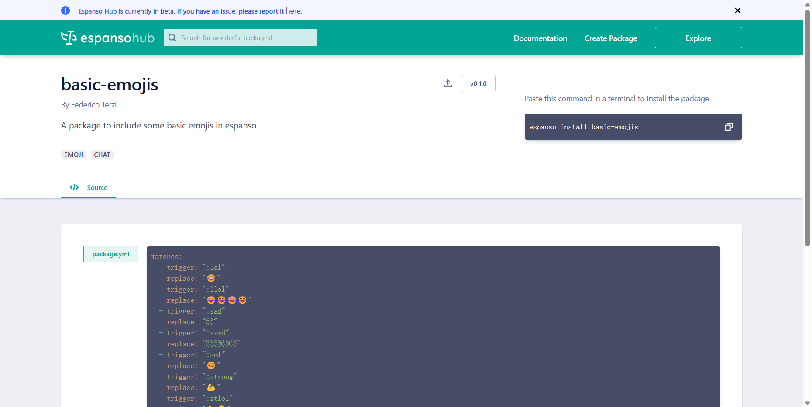

## 开始使用

Espanso 直接通过[官网](https://espanso.org/)安装即可，提供了 win，macOS，Linux 系统的版本。

鉴于 Espanso 的数字签名仍然相对较新，您可能会收到来自 Windows SmartScreen的警告。在这种情况下，只需单击 更多信息 <u>More info</u>，然后单击 无论如何运行 <u>Run anyway</u> 即可。

安装完成后，在终端输入指令

```shell
espanso edit
```

即可打开 Espanso 的触发器配置文件，也就是指定你想要的替换的文本的地方。默认的配置文件地址在：

```shell
C:\Users\<UserName>\AppData\Roaming\espanso\match\base.yml
```

这是一个 `.yml` 文件。安装完成后会自带一些实例的配置，



这时你可以通过输入 `:espanso` 来获得 -> Hi there!

如果您找不到配置路径，可以通过指令获得结果，配置文件在 Config 目录的 `match/base.yml` 中，

```zsh
> espanso path
Config: C:\Users\<User>\AppData\Roaming\espanso
Packages: C:\Users\<User>\AppData\Roaming\espanso\match\packages
Runtime: C:\Users\<User>\AppData\Local\espanso
```

> Ref: Office Document
>
> **The files contained in the `match` directory define *WHAT* Espanso should do.** In other words, this is where you should specify all the custom snippets and actions (aka Matches).

你可以在 `base.yml` 自行指定你的 trigger，例如你很频繁编写邮件，现在你想指定一个 match，减少你写邮件结语的工作量。那么在 `match/base.yml` 文件中的 `match` 层级底下添加你的新 trigger `:br` (你当然可以指定自己的指令， 例如 `:sign`，这里沿用了官方文档的例子，~~但是我实在是不知道这个 `br` 是什么的缩写~~)

```yml
 - trigger: ":br"
   replace: "Best Regards,\Anxiu"
```

Best Regards,

Anxiu

例如你有很多邮箱，每次发给别人其中一个指定的邮箱地址都要打一长串，你就可以使用 trigger 去 match 一个，例如 `:gmail` -> `exmaple@gmail.com`。

现在你已经掌握了 espanso 的简单使用，当然它还有很多其他功能，但是这个最基础的 match 已经可以为我们提供很多帮助了。

## Package 拓展

如果你认为一个一个指定 trigger 过于麻烦了，想要直接使用别人写好的 trigger。这当然是支持的！

```shell
$ espanso install basic-emojis
installing package: basic-emojis - version: latest
using package provider: espanso-hub
fetching package index...
validating sha256 signature...
found package: basic-emojis - version: 0.1.0
package installed!
```

使用 `espanso install` 指令安装公开的 `trigger`。你可以在 [Espanso Hub](https://hub.espanso.org/) 中找到许多丰富的配置，直接通过安装指令安装它们就可以使用了。

这里以 `basic-emojis` 这个 package 为例。



你可以直接在 espanso hub 上搜索到它，复制指令并执行。你就可以通过简短的指令输出表情啦！

😂

安装包后，espanso 会自动更新配置，但是如果没有更新，请使用指令 `espanso restart` 进行指令的更新。

## 动态匹配-时间戳例子

你需要为每个要替换的问题指定一个指令，在 espanso 中称其为 trigger，也就是触发器。

接下来我们来看看一个关于时间生成的触发器示例，

```yml
  - trigger: ":date"
    replace: "{{date_now}}"
    vars:
      - name: date_now
        type: date
        params:
          format: "%m/%d/%Y"
  
  - trigger: ":now"
    replace: "{{time_now}}"
    vars:
      - name: time_now
        type: date
        params:
          format: "%H:%M"
```

这里指定了两个指令 `:date` `:now` ，他们将分别生成日期信息和时间信息。

05/08/2023 14:16

在输入 `:date` `:now` 指令时，espanso 将指令替换成 `{{date_now}}` 和 `{{time_now}}` 中的内容。这两个在 espanso 中被称作 **variable**，即**变量**。然后我们在下面指定拓展内容 **extension**，即 `var` 层级下的内容。包括变量名 `name`，变量类型 `type`，变量参数 `params`。这里是时间，使用内置的宏？进行时间格式的输出。

更多内容请参考官方文档 [Overview | Espanso](https://espanso.org/docs/migration/overview/)。