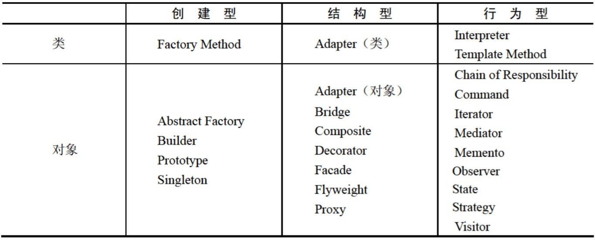
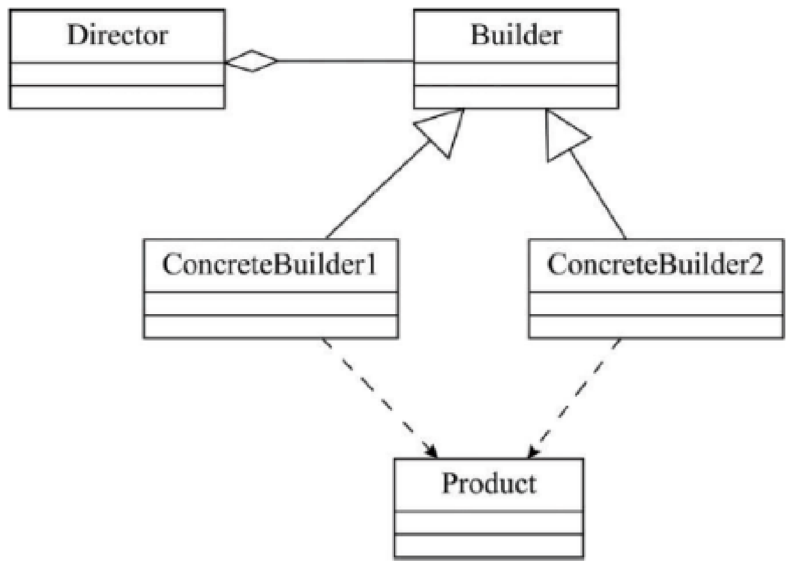
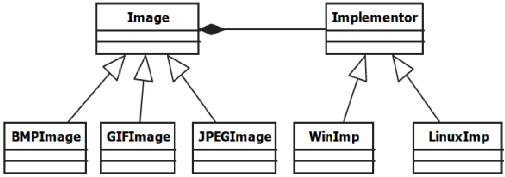
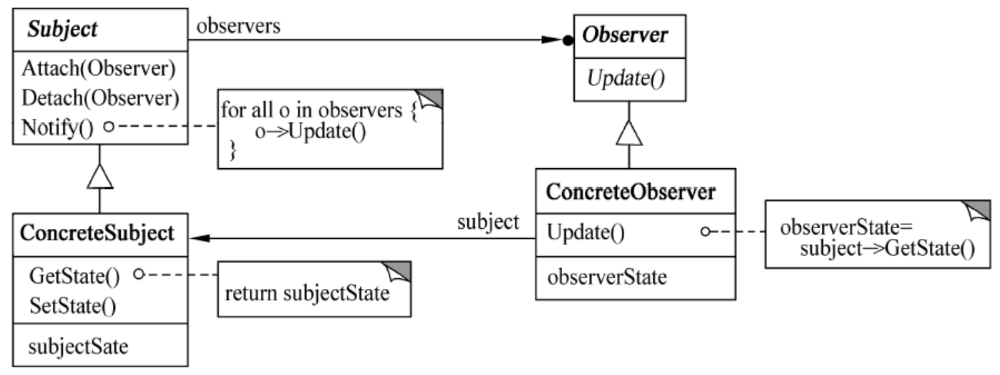
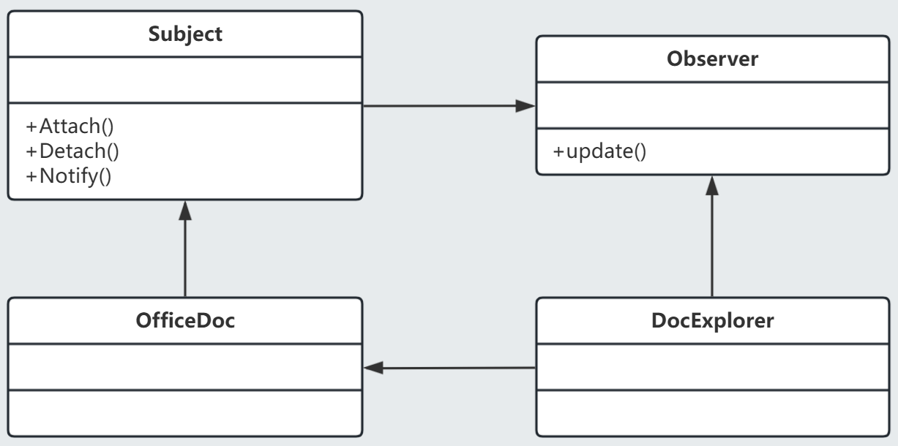
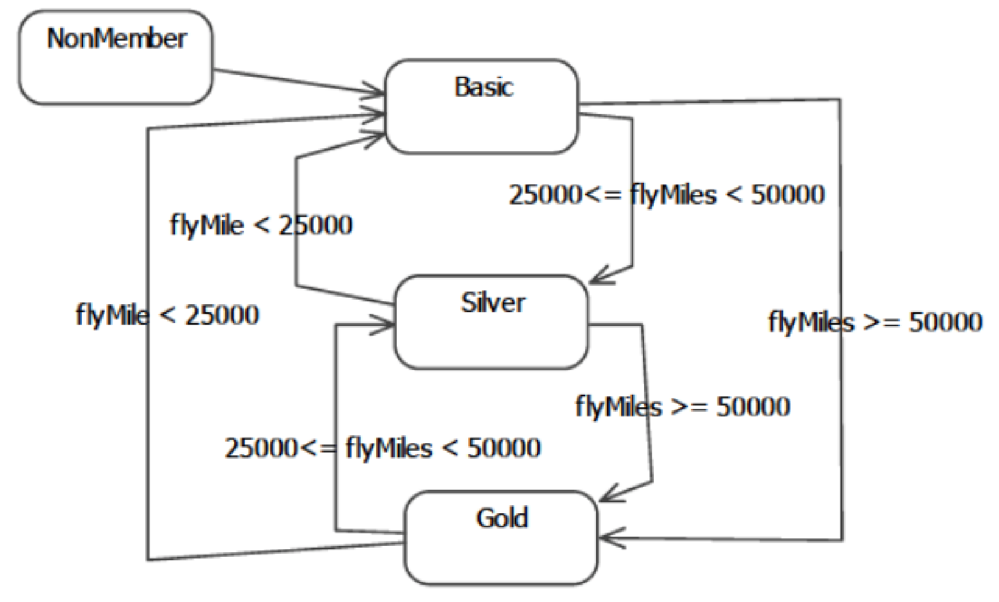
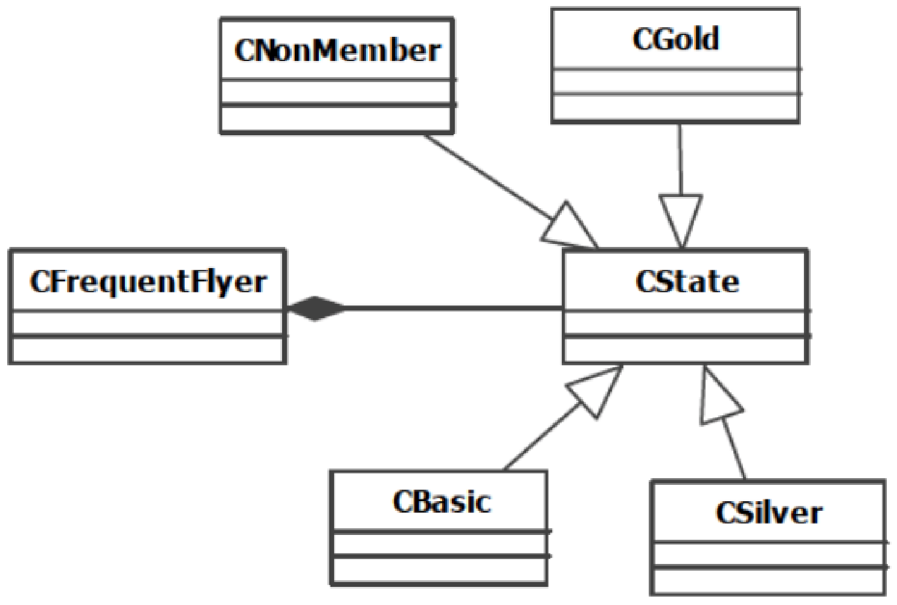
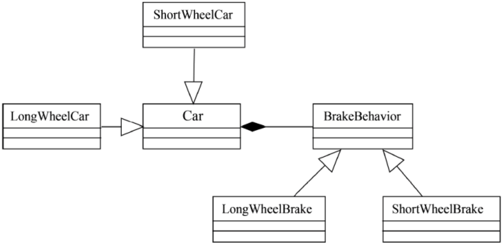

## 前置基础：面向对象设计原则 (SOLID 等)
> **备考提示：** 上午题常考，需理解每种原则的定义及目的是为了解决什么问题。
- 单一职责原则 (Single Responsibility Principle, SRP)

  就一个类而言，应该仅有一个引起它变化的原因。即，当需要修改某个类的时候原因有且只有一个，让一个类只做一种类型责任。

- 开放-封闭原则 (开闭原则，Open-Closed Principle, OCP) **[最重要]** 

  软件实体（类、模块、函数等）应该是可以扩展的，即开放的；但是不可修改的，即封闭的。

- 里氏替换原则 (Liskov Substitution Principle, LSP)

  子类型必须能够替换掉他们的基类型。即，在任何父类可以出现的地方，都可以用子类的实例来赋值给父类型的引用。当一个子类的实例应该能够替换任何其超类的实例时，它们之间才具有是一个 (is-a) 关系。

- 依赖倒置原则 (Dependency Inversion Principle, DIP)

  抽象不应该依赖于细节，细节应该依赖于抽象。即，高层模块不应该依赖于底层模块，二者都应该依赖于抽象。

- 接口隔离原则 (Interface Segregation Principle, ISP)

  不应该强迫客户依赖于它们不用的方法。接口属于客户，不属于它所在的类层次结构。即：依赖于抽象，不要依赖于具体，同时在抽象级别不应该有对于细节的依赖。这样做的好处就在于可以最大限度地应对可能地变化。

以上为面向对象方法中的五大原则，除此之外还有 重用发布等价原则 (Release Reuse Equivalency Principle, REP)，共同封闭原则 (Common Closure Principle, CCP)，共同重用原则 (Common Reuse Principle, CRP)，无环依赖原则 (Acyclic Dependencies Principle, ADP)，稳定依赖原则 (Stable Dependencies Principle, SDP)，稳定抽象原则 (Stable Abstractions Principle, SAP)。

> **[2010 年下半年上午 37-42]** 开-闭原则（Open-Closed Principle, OCP）是面向对象的可复用设计的基石。开-闭原则是指一个软件实体应当对 （37） 开放，对 （38） 关闭；里氏代换原则（Liskov Substitution Principle, LSP）是指任何 （39） 可以出现的地方， （40） 一定可以出现。依赖倒转原则（Dependence Inversion Principle, DIP）就是要依赖于 （41） ，而不依赖于 （42） ，或者说要针对接口编程，不要针对实现编程。

Software Engineering Professional Qualification Examination Design Pattern Handbook (Java Ver.)



## 创建型模式 (Creational Patterns) - 共 5 种
> **核心思想：** 关注对象的创建机制，将对象的创建与使用分离。
- [ ] **1.1 单例模式 (Singleton)**
  - 核心：保证一个类仅有一个实例，并提供全局访问点。
  - 重点：懒汉式、饿汉式、线程安全问题。
- [ ] **1.2 工厂方法模式 (Factory Method)**
  - 核心：定义创建对象的接口，让子类决定实例化哪一个类。
- [ ] **1.3 抽象工厂模式 (Abstract Factory)**
  - 核心：提供一个创建一系列相关或相互依赖对象的接口，而无需指定它们具体的类。（常与产品族概念结合考查）
- [ ] **1.4 建造者模式 (Builder)**
  - 核心：将一个复杂对象的构建与它的表示分离，使得同样的构建过程可以创建不同的表示。
- [ ] **1.5 原型模式 (Prototype)**
  - 核心：用原型实例指定创建对象的种类，并且通过拷贝这些原型创建新的对象。（深拷贝与浅拷贝）

---

### 单例模式 (Singleton)

一个类只允许创建一个对象或者叫实例，那这个类就是一个单例类，这种设计模式就是单例模式。从业务概念上，有些数据在系统中只应该保存一份，就比较适合设计为单例类，例如日志对象。


单例模式需要保证实例的唯一性，就是保证该实例在进程间唯一。
想要保证实例在进程间唯一，在 Java 中可以通过获取线程 id 的方式来完成，但是 Golang 中无法使用，go 协程并未暴露线程 id。
另外，如果想要实现集群环境之间唯一，就要通过外部共享存储的锁进行。

#### **如何实现单例模式？**

> 首先要考虑以下几个问题，
>
> - 构造函数是 private 访问权限
> - 考虑对象创建时的线程安全问题
> - 考虑是否支持延迟加载
> - 考虑 `GetInstance()` 方法的性能问题 (是否有加锁等)

具体实现分为以下几种方法，

#### 饿汉式 Eager Initialization

通过在结构体被加载时便为结构体创建一个实例，然后禁用构造方法(例如将构造方法标记为 `private` 权限)，在其他函数需要该类型时，用 `GetInstance()` 方法替代构造方法提供对象。

<CodeGroup>

```java
public class Singleton {
    private static final Singleton INSTANCE = new Singleton();

    private Singleton() {}

    public static Singleton getInstance() {
        return INSTANCE;
    }
}
```

```go
package singletonPattern

var Instance *object

func init() {
	Instance = &object{}
}

type object struct {
	name string
}

func (o *object) SetName(name string) {
	o.name = name
}

func (o *object) Hello() {
	println("Object Name:", o.name)
}

func GetInstance() *object {
	if Instance == nil {
		Instance = new(object)
	}
	return Instance
}
```

</CodeGroup>

测试运行

```go
package main

import "GolangDesignPattern/singletonPattern"

func main() {
	singletonPattern.Instance.SetName("Anxiu")
	singletonPattern.Instance.Hello()
}
```

运行结果

```shell
Object Name: Anxiu
```


#### 懒汉式 Lazy Initialization

懒汉式也成为延迟加载式，就是不在引入包时执行单实例的创建，但是当外部代码访问 `GetInstance()` 方法时，如果没有实例则创建实例，如果实例存在则返回实例对象。但是懒汉式由于需要在运行时进行创建，就不免要面对多线程的问题，需要加锁。

<CodeGroup>

```java
public class Singleton {
    private static volatile Singleton instance;

    private Singleton() {}

    public static Singleton getInstance() {
        if (instance == null) {
            synchronized (Singleton.class) {
                if (instance == null) {
                    instance = new Singleton();
                }
            }
        }
        return instance;
    }
}
```

```go
package singleton

import "sync"

var (
	lazyObj      *object
	once         = &sync.Once{}
)

func GetLazyInstance() *object {
	if lazyObj == nil {
		once.Do(func() {
			lazyObj = &object{}
		})
	}
	return lazyObj
}
```

</CodeGroup>


还有一种 Java 特定的创建方法，需要通过在类之内再写一个静态内部类，将变量声明在这个静态内部类中。当项目启动时，不会直接创建这个变量，但是调用时，触发对内部类的初始化，将其创建，则完成对于单实例的创建。


---

### 建造者模式 (Builder)


> #### 2018 年上半 软件设计师 Builder 案例
>
> 生成器（Builder）模式的意图是将一个复杂对象的构建与它的表示分离，使得同样的构建过程可以创建不同的表示。图 6-1 所示为其类图。
>
> 
>
> ```java
> package builder.Original2018First;
> 
> import java.util.*;
> 
> class Product {
>     private String partA;
>     private String partB;
> 
>     public Product(){}
> 
>     public void setPartA(String s) { partA = s; }
>     public void setPartB(String s) { partB = s; }
> }
> 
> interface Builder {
>     public void buildPartA();
>     public void buildPartB();
>     public Product getResult();
> }
> 
> class ConcreteBuilder1 implements Builder {
>     private Product product;
> 
>     public ConcreteBuilder1() { product = new Product(); }
> 
>     public void buildPartA() {
>         product.setPartA("Component A");
>     }
> 
>     public void buildPartB() {
>         product.setPartB("Component B");
>     }
> 
>     public Product getResult() { return product; }
> }
> 
> class Director {
>     private Builder builder;
> 
>     public Director(Builder builder) { this.builder = builder; }
> 
>     public void construct() {
>         builder.buildPartA();
>         // or builder.buildPartB();
>     }
> }
> 
> public class BuilderTest {
>     public static void main(String[] args) {
>         Director director1 = new Director(new ConcreteBuilder1());
>         director1.construct();
>     }
> }
> ```
>
> 


## 2. 结构型模式 (Structural Patterns) - 共 7 种
> **核心思想：** 关注类或对象的组合，探讨如何将现有的类或对象组织在一起形成更大的结构。
- [ ] **2.1 适配器模式 (Adapter)**
  - 核心：将一个类的接口转换成客户希望的另外一个接口。（类适配器与对象适配器）
- [ ] **2.2 桥接模式 (Bridge)**
  - 核心：将抽象部分与它的实现部分分离，使它们都可以独立地变化。（下午大题高频）
- [ ] **2.3 组合模式 (Composite)**
  - 核心：将对象组合成树形结构以表示“部分-整体”的层次结构。（涉及树/节点操作时常考）
- [ ] **2.4 装饰器模式 (Decorator)**
  - 核心：动态地给一个对象添加一些额外的职责。比生成子类更为灵活。（下午大题高频）
- [ ] **2.5 外观模式 (Facade)**
  - 核心：为子系统中的一组接口提供一个一致的界面，使得子系统更加容易使用。
- [ ] **2.6 享元模式 (Flyweight)**
  - 核心：运用共享技术有效地支持大量细粒度的对象。（常考数据库连接池、字符/棋子复用等场景）
- [ ] **2.7 代理模式 (Proxy)**
  - 核心：为其他对象提供一种代理以控制对这个对象的访问。

---

### 桥接模式 (Bridge)


> #### 2017 年下半  软件设计师 Bridge 案例
>
> 某图像预览程序要求能够查看 BMP、JPEG 和 GIF 三种格式的文件，且能够在 Windows和 Linux 两种操作系统上运行。程序需具有较好的扩展性以支持新的文件格式和操作系统。为满足上述需求并减少所需生成的子类数目，现采用桥接（Bridge）模式进行设计，得到如图 6-1 所示的类图。
>
> 
>
> ```java
> package bridge.Original2017Second;
> 
> import java.util.*;
> 
> class Matrix {
> 
> }
> 
> abstract class Implementor {
>     public abstract void doPaint(Matrix m);
> }
> 
> class WinImp extends Implementor {
>     public void doPaint(Matrix m) {
> 
>     }
> }
> 
> class LinuxImp extends Implementor {
>     public void doPaint(Matrix m) {
> 
>     }
> }
> 
> abstract class Image {
>     protected Implementor imp;
> 
>     public abstract void parseFile(String fileName);
> 
>     public void setImp(Implementor imp) { this.imp = imp;}
> }
> 
> class BMPImage extends Image {
> 
>     @Override
>     public void parseFile(String fileName) {
>         System.out.println("BMPImage parse: " + fileName);
>     }
> }
> 
> class GIFImage extends Image {
>     @Override
>     public void parseFile(String fileName) {
>         System.out.println("GIFImage parse: " + fileName);
>          imp.doPaint(m);
>     }
> }
> 
> class JPEGImage extends Image {
>     @Override
>     public void parseFile(String fileName) {
>         System.out.println("JPEGImage parse: " + fileName);
>         // imp.doPaint();
>     }
> }
> 
> public class BridgeTest {
>     public static void main(String[] args) {
>         Image image = new GIFImage();
>         Implementor imageImp = new LinuxImp();
>         image.setImp(imageImp);
>         image.parseFile("demo.gif");
>     }
> }
> 
> ```
>
> 


---

### 代理模式 (Proxy)

代理模式示例 — 图片延迟加载

```java title="代理模式 — 虚拟代理" fold=true
interface Image {
    void display();
}

class RealImage implements Image {
    private String fileName;

    public RealImage(String fileName) {
        this.fileName = fileName;
        loadFromDisk();
    }

    private void loadFromDisk() {
        System.out.println("Loading " + fileName);
    }

    @Override
    public void display() {
        System.out.println("Displaying " + fileName);
    }
}

class ProxyImage implements Image {
    private RealImage realImage;
    private String fileName;

    public ProxyImage(String fileName) {
        this.fileName = fileName;
    }

    @Override
    public void display() {
        if (realImage == null) {
            realImage = new RealImage(fileName);
        }
        realImage.display();
    }
}
```

## 3. 行为型模式 (Behavioral Patterns) - 共 11 种
> **核心思想：** 关注类或对象之间的交互以及职责的分配。
- [ ] **3.1 责任链模式 (Chain of Responsibility)**
  - 核心：将请求的发送者和接收者解耦，使多个对象都有机会处理这个请求。
- [ ] **3.2 命令模式 (Command)**
  - 核心：将一个请求封装为一个对象，从而使你可用不同的请求对客户进行参数化。
- [ ] **3.3 解释器模式 (Interpreter)**
  - 核心：给定一个语言，定义它的文法的一种表示，并定义一个解释器。（极低频，了解概念即可）
- [ ] **3.4 迭代器模式 (Iterator)**
  - 核心：提供一种方法顺序访问一个聚合对象中各个元素，而又不暴露该对象的内部表示。
- [ ] **3.5 中介者模式 (Mediator)**
  - 核心：用一个中介对象来封装一系列的对象交互，使得各对象不需要显式地相互引用。
- [ ] **3.6 备忘录模式 (Memento)**
  - 核心：在不破坏封装性的前提下，捕获一个对象的内部状态，并在该对象之外保存这个状态。
- [ ] **3.7 观察者模式 (Observer / Publish-Subscribe)**
  - 核心：定义对象间的一种一对多的依赖关系，当一个对象的状态发生改变时，所有依赖于它的对象都得到通知并被自动更新。（下午大题极高频）
- [ ] **3.8 状态模式 (State)**
  - 核心：允许一个对象在其内部状态改变时改变它的行为。（下午大题极高频，常伴随状态图出现）
- [ ] **3.9 策略模式 (Strategy)**
  - 核心：定义一系列的算法，把它们一个个封装起来，并且使它们可相互替换。（下午大题极高频）
- [ ] **3.10 模板方法模式 (Template Method)**
  - 核心：定义一个操作中的算法的骨架，而将一些步骤延迟到子类中。
- [ ] **3.11 访问者模式 (Visitor)**
  - 核心：表示一个作用于某对象结构中的各元素的操作。它使你可以在不改变各元素的类的前提下定义作用于这些元素的新操作。（下午大题高频，结构较复杂）


---

### 观察者模式 (Observer)

观察者模式允许你定义一种订阅机制， 可在对象事件发生时通知多个 “观察” 该对象的其他对象。

> 定义对象间的一种**一对多**的依赖关系，当一个对象的状态改变时，所有依赖于它的对象都得到通知并被自动更新。
>
> 图 7-44

`Observer` 定义观察者的抽象接口，包含一个 `Update()` 方法用于处理 `Subject` 状态变动后的更新逻辑，（按照官方教材的逻辑，订阅行为在创建具体的观察者对象`ConcreteObserver`时完成，观察者创建方法接受一个 `Subject subject` 并调用 `subject.Attach(this)` 将自身添加到 `Subject` 的订阅列表中。）

> #### 2019 年下半 软件设计师 Observer 案例
>
> 某文件管理系统中定义了类 OfficeDoc 和 DocExplorer。当类 OfficeDoc 发生变化时，类 DocExplorer 的所有对象都要更新其自身的状态。现采用观察者（Observer）设计模式来实现该需求，所设计的类图如图 6-1 所示。
>
> 
>
> ```java
> import java.util.*;
> 
> interface Observer {
>     public _(1)_;
> }
> 
> interface Subject {
>     public void Attach(Observer obs);
>     public void Detach(Observer obs);
>     public void Notify();
>     public void setStatus(int status);
>     public int getStatus();
> }
> 
> class OfficeDoc implements Subject {
>     private List<_(2)_> myObs;
>     private String mySubjectName;
>     private int m_status;
> 
>     public OfficeDoc(String name) {
>         mySubjectName = name;
>         this.myObs = new ArrayList<Observer>();
>         m_status = 0;
>     }
> 
>     public void Attach(Observer obs) { this.myObs.add(obs); }
> 
>     public void Detach(Observer obs) { this.myObs.remove(obs); }
> 
>     public void Notify() {
>         for (Observer obs : this.myObs) { _(3)_ }
>     }
> 
>     public void setStatus(int status) {
>         m_status = status;
>         System.out.println("SetStatus subject[" + mySubjectName + "]status:" + status);
>     }
> 
>     public int getStatus() { return m_status; }
> }
> 
> class DocExplorer implements Observer {
>     private String myObsName;
> 
>     public DocExplorer(String name, _(4)_ sub) {
>         myObsName = name;
>         sub._(5)_;
>     }
> 
>     public void update() {
>         System.out.println("update observer[" + myObsName + "]");
>     }
> }
> 
> 
> class ObserverTest {
>     public static void main(String[] args) {
>         Subject subjectA = new OfficeDoc("subject A");
>         Observer observerA = new DocExplorer("observer A", subjectA);
>         subjectA.setStatus(1);
>         subjectA.notify();
>     }
> }
> ```

参考答案
1. void update()
2. Observer
3. obs.update()
4. Subject
5. Attach(this)

---

### 状态模式 (State)


> #### 2018 年下半 软件设计师 试题六 State 案例
>
> 某航空公司的会员积分系统将其会员划分为：普卡(Basic)、银卡(Silver)和金卡(Gold)三个等级。非会员(NonMember)可以申请成为普卡会员。会员的等级根据其一年内累积的里程数进行调整。描述会员等级调整的状态图如图 6-1 所示。现采用状态(State)模式实现上述场景，得到如图 6-2 所示的类图。
>
>  6-1 会员等级调整状态图
>
> 6-2 状态模式类图
>
> ```java
> package state.Original2018Second;
> 
> import java.util.*;
> 
> abstract class CState {
>     public int flyMiles;
>     public double travel(int miles, CFrequentFlyer context){return miles;};
> }
> 
> class CNoCustomer extends CState {
>     public double travel(int miles, CFrequentFlyer context) {
>         System.out.println("Your travel will not account for points");
>         return miles;
>     }
> }
> 
> class CBasic extends CState { // 普卡会员
>     public double travel(int miles, CFrequentFlyer context) {
>         if (context.flyMiles >= 25000 && context.flyMiles < 50000) {
>             context.setState(new CSilver());
>         }
>         if (context.flyMiles >= 50000) {
>             context.setState(new CGold());
>         }
>         return miles;
>     }
> }
> 
> class CGold extends CState {
>     public double travel(int miles, CFrequentFlyer context) {
>         if (context.flyMiles >= 25000 && context.flyMiles < 50000) {
>             context.setState(new CSilver());
>         }
>         if (context.flyMiles < 25000) {
>             context.setState(new CBasic());
>         }
>         return miles + 0.5 * miles;
>     }
> }
> 
> class CSilver extends CState { // 银卡会员
>     public double travel(int miles, CFrequentFlyer context) {
>         if (context.flyMiles <= 25000) {
>             context.setState(new CBasic());
>         }
>         if (context.flyMiles >= 50000) {
>             context.setState(new CGold());
>         }
>         return (miles + 0.25 * miles);
>     }
> }
> 
> class CFrequentFlyer {
>     CState state;
>     double flyMiles;
> 
>     public CFrequentFlyer() {
>         state = new CNoCustomer();
>         flyMiles = 0;
>         setState(state);
>     }
> 
>     public void setState(CState state) {
>         this.state = state;
>     }
> 
>     public void travel(int miles) {
>         double bonusMiles = state.travel(miles, this);
>         flyMiles = flyMiles + bonusMiles;
>     }
> }
> 
> public class StateTest {
> }
> 
> ```
>
> 


---

### 策略模式


> 某软件公司欲开发一款汽车竞速类游戏，需要模拟长轮胎和短轮胎急刹车时在路面上留下的不同痕迹，并考虑后续能模拟更多种轮胎急刹车时的痕迹。现采用策略（Strategy）设计模式来实现该需求，所设计的类图如图 6-1 所示。
>
> 
>
> ```java
> package strategy.Original2019First;
> 
> import java.util.*;
> 
> interface BrakeBehavior {
>     public void stop();
> }
> 
> class LongWheelBrake implements BrakeBehavior {
>     public void stop() { System.out.println("模拟长轮胎刹车痕迹！"); }
> }
> 
> class ShortWheelBrake implements BrakeBehavior {
>     public void stop() { System.out.println("模拟短轮胎刹车痕迹！"); }
> }
> 
> abstract class Car {
>     protected BrakeBehavior wheel;
> 
>     public void brake() {
>         this.wheel.stop();
>     }
> }
> 
> class ShortWheelCar extends Car {
>     public ShortWheelCar(BrakeBehavior behavior) {
>         this.wheel = behavior;
>     }
> }
> 
> public class StrategyTest {
>     public static void main(String[] args) {
>         BrakeBehavior brake = new ShortWheelBrake();
>         ShortWheelCar car1 = new ShortWheelCar(brake);
>         car1.brake();
>     }
> }
> 
> ```
>
> 


## 4. 下午大题专项突破 (代码与 UML 映射)
> **备考提示：** 下午题不仅要求认识模式，还需要能看懂 UML 类图并补全代码。
- [ ] **4.1 UML 类图基础**
  - [ ] 泛化 (Generalization) / 继承
  - [ ] 实现 (Realization)
  - [ ] 关联 (Association)
  - [ ] 聚合 (Aggregation)
  - [ ] 组合 (Composition)
  - [ ] 依赖 (Dependency)
- [ ] **4.2 高频模式代码默写与填空技巧**
  - [ ] 接口与抽象类的定义语法 (Java/C++)
  - [ ] 多态的应用与向下转型
  - [ ] 如何根据 UML 图中的连线推导类中的成员变量
- [ ] **4.3 历年真题实战演练 (错题本)**
  - [ ] [填写年份] 真题 - [涉及的设计模式]
  - [ ] [填写年份] 真题 - [涉及的设计模式]