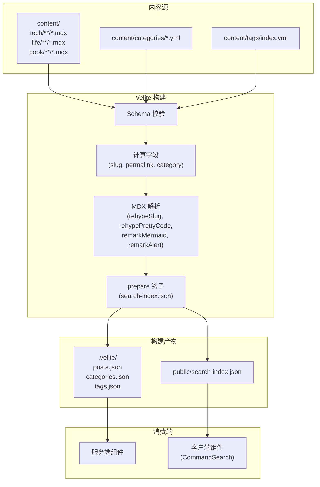
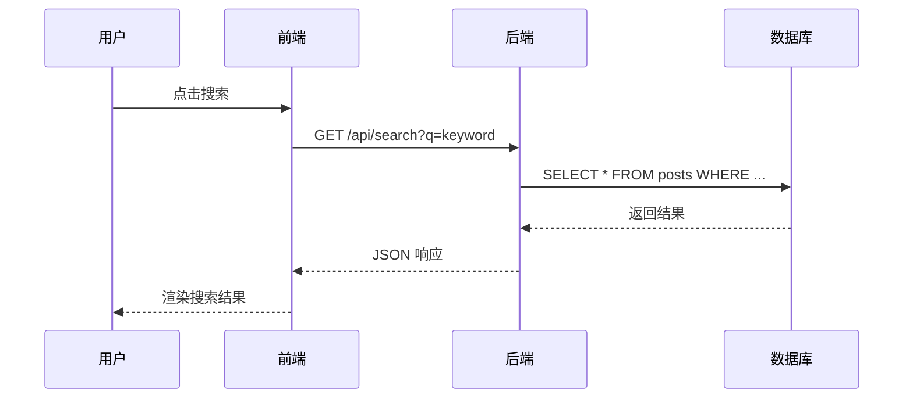
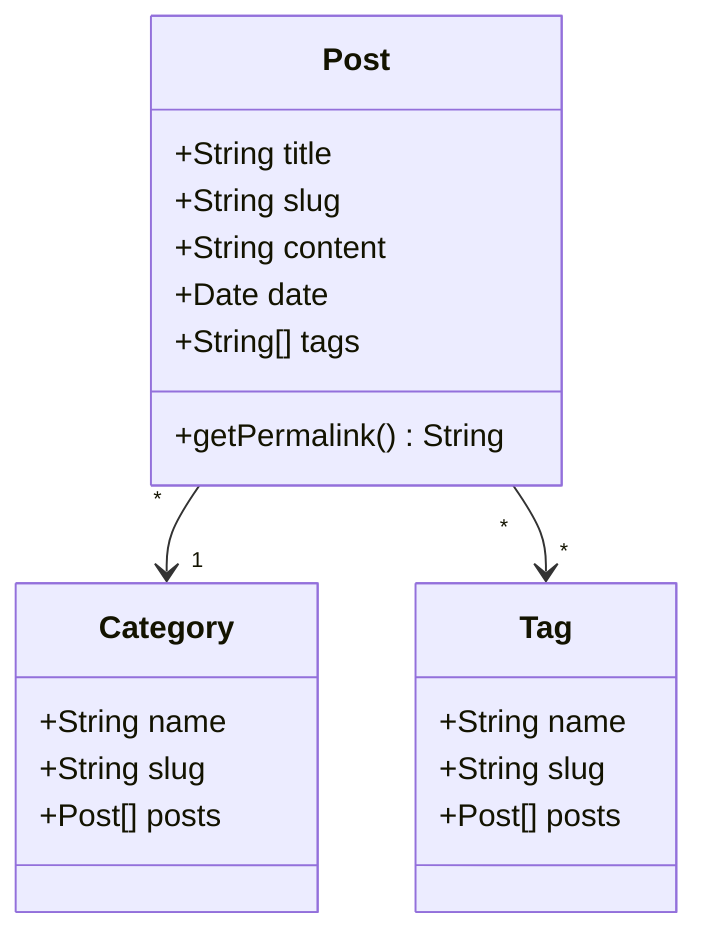

## Mermaid 流程图



## Mermaid 时序图



## Mermaid 类图



## Alert 告警框

```info
这是一条普通提示信息，用于向读者传递补充说明或背景知识。
```

```tip
这是一条小贴士，提供最佳实践或实用建议。
```

```warning
这是一条警告，提醒读者注意潜在问题或常见陷阱。
```

```error
这是一条错误提示，说明严重问题或需要立即关注的事项。
```

## 代码块测试

### TypeScript

```ts
interface User {
  id: string
  name: string
  email: string
}

async function fetchUser(id: string): Promise<User> {
  const res = await fetch(`/api/users/${id}`)
  if (!res.ok) throw new Error("Failed to fetch user")
  return res.json()
}
```

### Go

```go
package main

import "fmt"

type Greeter struct {
    Name string
}

func (g *Greeter) Greet() string {
    return fmt.Sprintf("Hello, %s!", g.Name)
}

func main() {
    g := &Greeter{Name: "World"}
    println(g.Greet())
}
```

### Python

```python
from datetime import datetime
from typing import List


class BlogPost:
    def __init__(self, title: str, tags: List[str]):
        self.title = title
        self.tags = tags
        self.created_at = datetime.now()

    def summary(self) -> str:
        return f"{self.title} [{', '.join(self.tags)}]"
```

## 表格

| 特性 | 状态 | 优先级 | 备注 |
|------|------|--------|------|
| Mermaid 图表 | ✅ 已完成 | 高 | 流程图、时序图、类图 |
| Alert 告警框 | ✅ 已完成 | 高 | info / tip / warning / error |
| 搜索功能 | ✅ 已完成 | 高 | Fuse.js + Command Palette |
| RSS 订阅 | ✅ 已完成 | 中 | Route Handler + 自动发现 |
| TOC 滚动监听 | ⏳ 待办 | 中 | IntersectionObserver |
| 代码行号 | ⏳ 待办 | 低 | rehype-pretty-code 支持 |

## 引用块

> 这是普通引用块，用于标注外部引用或名人名言。
>
> 支持多段落引用。

## 自定义块引用

> [!NOTE]
> 这是一条 GitHub 风格的 NOTE 提示。此格式可以通过自定义 remark 插件解析为带样式的 Alert 组件。

> [!WARNING]
> 这是一条 GitHub 风格的 WARNING 提示。

## 列表

### 无序列表

- Mermaid 图表支持
  - 流程图（Flowchart）
  - 时序图（Sequence Diagram）
  - 类图（Class Diagram）
- Alert 告警框
  - 信息（info / note）
  - 提示（tip / success）
  - 警告（warn / warning）
  - 错误（error / danger）

### 有序列表

1. 安装依赖 `yarn add mermaid`
2. 创建 Remark 插件转换 `` ```mermaid `` 代码块
3. 创建客户端 Mermaid 渲染组件
4. 注册到 `mdx-content.tsx` 的 `sharedComponents`

#### 四级标题示例

这是一段位于四级标题下方的正文，用于测试四级标题的 `scroll-m-20` 行为和字体大小。

##### 五级标题示例

五级标题用于更深层的章节划分。

## 图片


## 行内代码与链接

本项目使用 `next-themes` 管理主题切换，使用 `remark-gfm` 和 `remark-mermaid` 自定义插件进行 MDX 预处理。更多详情请查阅 [项目文档](/about)。

## 分割线

---

以上就是在本站目前支持的全部 MDX 渲染特性[^1]。后续将持续完善 TOC 滚动监听、代码行号等功能[^2]。

[^1]: 包括 Mermaid、Alert、代码块、表格、引用、脚注等特性。
[^2]: 参考 [rehype-pretty-code](https://rehype-pretty.pages.dev) 文档获取行号配置方式。
