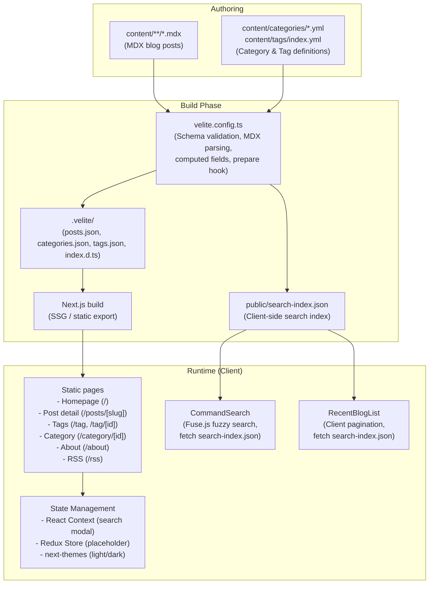
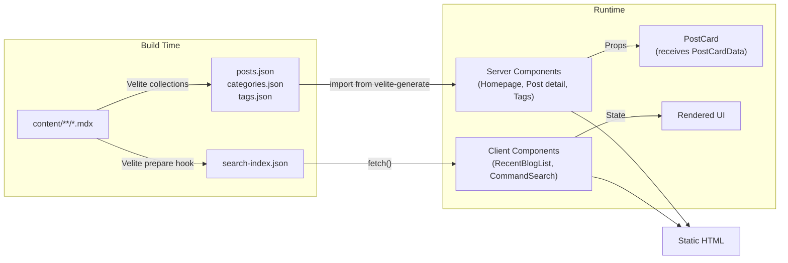

# Architecture

## Overview

Anxiu Online is a statically-generated personal blog built with Next.js 16 App Router. Content is authored in MDX, processed by Velite at build time, and served as fully static HTML pages. Client-side features (search, pagination, theme toggle) use React Context and local state — no backend API or database required at runtime.

## System Diagram



## Route Architecture

```
/                           → (blog)/page.tsx        Homepage: ProfileCard + RecentBlogList
/posts/[slug]               → (blog)/posts/[slug]/   Single post view with TOC, MDX, meta, navigation
/tag                        → (blog)/tag/page.tsx     All tags grid with post counts
/tag/[id]                   → (blog)/tag/[id]/        Posts filtered by tag
/category/[id]              → (blog)/category/[id]/   Posts filtered by category (WIP — placeholder)
/about                      → about/page.tsx          About page (WIP — placeholder)
/rss                        → rss/route.ts            RSS 2.0 feed (force-static)
```

- `(blog)/` is a **route group** — adds no URL segment, used to share `layout.tsx`.
- Post detail pages use `generateStaticParams()` for SSG; all slugs are known at build time.
- RSS route uses `dynamic = "force-static"` — generated once at build.

## Component Architecture

```
RootLayout (app/layout.tsx)
├── ThemeProvider          (next-themes — class strategy, default light)
│   ├── SearchProvider     (React Context — controls CommandSearch modal open/close)
│   │   ├── CommandSearch  (Ctrl+K fuzzy search via Fuse.js + search-index.json)
│   │   └── ScrollToTop    (Floating top button)
│   ├── Header
│   │   ├── AnxiuInfoLogo  (SVG logo with site name)
│   │   ├── BlogNavigationMenu  (Desktop dropdown + mobile flat list)
│   │   │   └── config/nav-item.ts  (Navigation configuration)
│   │   ├── Search button  (Opens CommandSearch modal)
│   │   └── ThemeToggle    (Light/Dark toggle icon button)
│   ├── <main>             (Page content — flex-1 column)
│   └── Footer
│       └── LicenseInfo    (CC BY-NC-SA 4.0 badges)
```

### Blog Post Page Component Tree

```
PostPage (app/(blog)/posts/[slug]/page.tsx)
├── PostToolbar            (Copy link / copy raw / info sheet buttons)
├── TableOfContent         (Recursive TOC, depth ≤2)
├── MDXContent             (Runtime MDX renderer)
│   ├── CodeBlock          (<pre> wrapper with copy button)
│   ├── ImageWithFallback  ( with error fallback to SVG)
│   ├── TravelGallery      (Image carousel with lightbox)
│   └── sharedComponents   (h2, h3, p, code, a, ul, ol, li, blockquote)
├── PostMeta               (Tags, author, date, word count, ref link)
└── PostNavigation         (Prev / Next post links)
```

### Homepage Component Tree

```
HomePage (app/(blog)/page.tsx)
├── ProfileCard            (Hero card with avatar, bio, social links)
└── RecentBlogList         (Client-side paginated list, 7 per page)
    └── PostCard           (Card with title, description, tags, date, reading time)
        └── BlogTag        (Tag badge linking to /tag/[id])
```

## Data Flow



**Key point:** Server components import directly from `velite-generate` (`.velite/` output). Client components can NOT import from `velite-generate` at build time — they fetch `/search-index.json` at runtime instead. The `PostCard` component accepts `PostCardData` props so it can be used in both contexts.

## State Management Strategy

| Mechanism | Scope | Usage |
|-----------|-------|-------|
| **React Context** (`use-search.tsx`) | App-wide | Search modal open/close state |
| **next-themes** (`ThemeProvider`) | App-wide | Light/dark mode, persisted to `<html class>` |
| **Redux Toolkit** (`app/store.ts`) | App-wide | Currently placeholder (`counter` slice only) |
| **React local state** | Component | Pagination, mobile menu toggle |

**Guideline:** Start with React Context or local state. Only add Redux slices when:
- State is needed across deeply nested, unrelated component trees
- State requires middleware (e.g., logging, persistence, async thunks)
- Multiple slices need to coordinate state changes

## Styling Architecture

```
Tailwind CSS v4 (PostCSS plugin)
├── tw-animate-css          (Animation utilities)
├── @tailwindcss/typography  (Prose typography)
├── shadcn/ui CSS Variables  (Neutral base, oklch color space)
│   ├── :root (light)       (--background, --foreground, --primary, ...)
│   └── .dark (dark)        (Overrides for dark mode)
├── @theme inline            (Maps CSS vars to Tailwind color tokens)
└── @layer base              (Border/outline defaults, shiki code theme overrides)
```

- **Theme:** shadcn/ui New York style, neutral base color, CSS variables mode
- **Class merging:** Always use `cn()` from `@/lib/utils` (clsx + tailwind-merge)
- **Dark mode:** `next-themes` applies `.dark` class to `<html>`, CSS variables handle the rest

## Key Design Decisions

1. **Velite over Contentlayer:** Contentlayer is unmaintained for newer Next.js versions. Velite is actively maintained and supports MDX, Zod schemas, and `prepare` hooks.
2. **Client-side search over server-side:** Generates `search-index.json` at build time, fetches on client, uses Fuse.js for fuzzy matching. Zero runtime cost, works on fully static hosting.
3. **`search-index.json` shared between search and pagination:** The homepage `RecentBlogList` fetches the same index for client-side pagination, avoiding another data source.
4. **MDX rendering via `new Function()`:** Velite compiles MDX to a serialized JS function string. `useMDXComponent()` evalutes it at runtime with `react/jsx-runtime`, allowing custom component injection.
5. **No SSG for tag/category pages (currently):** Tag and category pages are SSR (dynamic rendering). The search index is used for listing posts. This may change to SSG with `generateStaticParams` in the future.

## File Naming Conventions

| Type | Convention | Example |
|------|-----------|---------|
| Files | `kebab-case.tsx` | `post-toolbar.tsx`, `blog-info-sheet.tsx` |
| Components | `PascalCase` named export | `PostToolbar`, `BlogInfoSheet` |
| Blog post components | `post-` prefix in `components/blog/` | `post-meta.tsx`, `post-navigation.tsx` |
| Blog-wide components | `blog-` prefix in `components/blog/` | `blog-tag.tsx`, `blog-info-sheet.tsx` |
| shadcn/ui primitives | `components/ui/` | `button.tsx`, `dialog.tsx`, `card.tsx` |
| MDX rendering components | `components/mdx/` | `mdx-content.tsx`, `code-block.tsx` |
| Layout components | `components/layout/` | `header.tsx`, `footer.tsx` |
