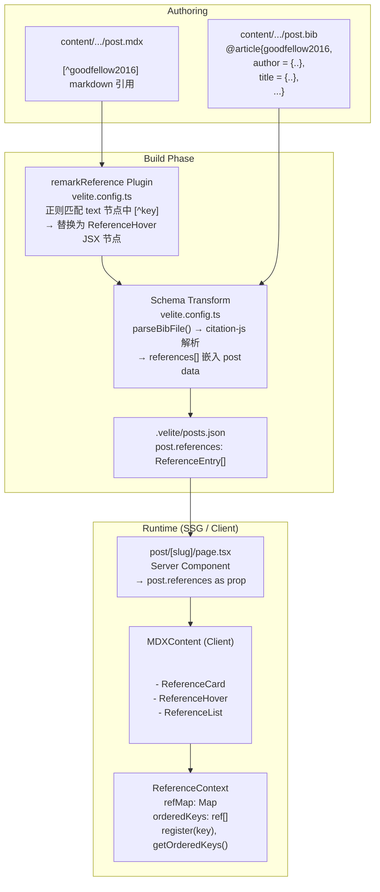

# Reference Card 引用系统

## Overview

文章内引用卡片系统，支持 BibTeX 参考文献管理、行内悬浮预览和块级引用卡片。采用 "companion `.bib` 文件" 模式：每篇 MDX 文章平级放置一个 `refs.bib` 或同名的 `.bib` 文件，在构建时由 Velite schema 解析并嵌入 post 数据，运行时通过 React Context 消费。

## Pipeline Diagram



## File Structure

```
content/tech/2026/
├── some-post.mdx              ← MDX article, uses [^key] and <ReferenceCard>
└── some-post.bib              ← Optional companion BibTeX file

components/mdx/
├── reference-context.tsx      ← React Context (ReferenceProvider + useReference)
├── reference-card.tsx         ← Block-level card (uses shadcn/ui Card)
├── reference-hover.tsx        ← Inline HoverCard citation
└── reference-list.tsx         ← Auto-collected bottom reference list

types/
├── index.d.ts                 ← ReferenceEntry interface
└── citation-js.d.ts           ← citation-js type declarations
```

## Components

### ReferenceCard — 块级引用卡片

用于文章的主要引用场景（书评、论文翻译、读后感开头）。渲染为 shadcn/ui `Card`，显示类型标签、标题、作者、年份、出版社和外部链接。

```mdx
<ReferenceCard citeKey="goodfellow2016" />
```

- 类型标签（Badge）：Book / Journal Article / Conference Paper 等，自动从 BibTeX entry type 映射
- 标题：`ref.url` 存在时包裹为 `next/link` 链接，同时支持 hover 下划线；为空时纯文本
- DOI 图标：右上角，点击跳转 `https://doi.org/...`
- 外部链接：底部显示完整 URL

### ReferenceHover — 行内悬浮引用

用于正文中的行内引用。写作时使用 `[^key]` 原生 Markdown 风格，运行时渲染为 `[1]` 编号上标，hover 弹出结构化预览。

```mdx
深度学习[^goodfellow2016]中的 Transformer 架构[^vaswani2017]。
```

- **写作语法**：`[^key]`（以字母开头的非数字 key 被识别为引用；纯数字 `[^1]` 保持为 GFM 脚注）
- **渲染显示**：`[1]` `[2]`（按出现顺序自动编号）
- **HoverCard**：悬浮显示标题、作者、出处、链接
- **编号机制**：render 阶段通过 `register(key)` + `getOrderedKeys()` 自编号，无需 `useState`/`useEffect`，SSR 友好

### ReferenceList — 参考文献列表

文章底部自动收集所有被引用条目的编号列表。

```mdx
<ReferenceList />
```

- 自动读取 `orderedKeys`，按注册顺序渲染 `<ol>`
- 每项显示：`[1] Authors. Title. *Journal*. Publisher. Year. [DOI]`
- 无引用时自动隐藏（`return null`）

## MDX Writing Experience

```mdx
## 引言

<ReferenceCard citeKey="goodfellow2016" />

深度学习[^goodfellow2016]在近年来取得了显著进展。
Transformer 架构[^vaswani2017]的提出彻底改变了 NLP 领域。
表格理解方面也有相关研究[^goodman2024tabgen]。

## References

<ReferenceList />
```

写作规则：
- **块级引用**：`<ReferenceCard citeKey="key" />`
- **行内引用**：`[^key]`（需以字母开头，`[^1]` 等数字形式保留为原生脚注）
- **参考文献列表**：`<ReferenceList />`

## BibTeX Companion File (.bib)

### 文件命名

与 MDX 文件同级、同主名、`.bib` 后缀：

```
content/tech/2026/deep-learning-intro.mdx
content/tech/2026/deep-learning-intro.bib     ← companion file
```

### 格式

标准 BibTeX：

```bibtex
@book{goodfellow2016,
  author    = {Goodfellow, Ian and Bengio, Yoshua and Courville, Aaron},
  title     = {Deep Learning},
  publisher = {MIT Press},
  year      = {2016},
  isbn      = {978-0262035613}
}

@article{vaswani2017,
  author  = {Vaswani, Ashish and Shazeer, Noam and Parmar, Niki and
             Uszkoreit, Jakob and Jones, Llion and Gomez, Aidan N. and
             Kaiser, {\L}ukasz and Polosukhin, Ilia},
  title   = {Attention Is All You Need},
  journal = {Advances in Neural Information Processing Systems},
  year    = {2017},
  url     = {https://arxiv.org/abs/1706.03762}
}

@misc{goodman2024tabgen,
  author       = {Goodman, Daniel and Chen, Jing},
  title        = {TabGen: A Dataset Generation Framework for Table Understanding},
  year         = {2024},
  publisher    = {arXiv},
  doi          = {10.48550/arXiv.2401.12345}
}
```

BibTeX `@entrytype` 自动映射到 `ReferenceEntry.type`，显示时转为可读标签。

## Data Flow

### 1. Build Time — Velite Schema Transform

在 `velite.config.ts` 的 `postBlogSchema` 中，第三个 `.transform()` 调用 `parseBibFile(meta.path)`：

```typescript
.transform(async (data, { meta }) => {
    const references = await parseBibFile(meta.path)
    return { ...data, references }
})
```

`parseBibFile()` 流程：
1. 从 `meta.path`（如 `tech/2026/deep-learning-intro.mdx`）构建 `.bib` 路径
2. 尝试多个路径变体（相对路径、process.cwd()、content 前缀）
3. 读取 `.bib` 内容，使用 `@citation-js/core` + `@citation-js/plugin-bibtex` 解析
4. 规范化输出为 `ReferenceEntry[]`（CSL-JSON → 精简结构）
5. 无 `.bib` 文件时返回空数组（零开销）

`ReferenceEntry` schema（`velite.config.ts`）：
```typescript
const referenceEntrySchema = s.object({
    key: s.string(),
    type: s.string(),
    title: s.string(),
    author: s.string().optional(),
    year: s.number().optional(),
    publisher: s.string().optional(),
    containerTitle: s.string().optional(),
    url: s.string().optional(),
    doi: s.string().optional(),
    isbn: s.string().optional(),
})
```

序列化后的 post data 中，每个 post 的 `references` 字段只包含**该篇自己的引用**，无全局 JSON 文件。

### 2. Build Time — remarkReference Plugin

`remarkReference` 是 Velite remark 插件链中的自定义插件，在 `remarkGfm` 之前运行：

```
remarkPlugins: [remarkGfm, remarkMermaid, remarkAlert, remarkReference]
```

**注意**：插件排在 `remarkGfm` **之前**以防止被 GFM footnote 解析拦截。

工作流程：
1. 遍历 AST，对每个 `text` 节点应用正则 `/\[\^([a-zA-Z][\w.-]*)\]/g`
2. `splitText()` 将 text 节点按 `[^key]` 分割为 text + `mdxJsxTextElement` 片段
3. 生成的 JSX 节点为 `<ReferenceHover citeKey="key" />`（inline 元素，非 flow）
4. 同时收集 citation keys，用于清理可能存在的同名 `footnoteDefinition` 节点
5. 纯数字 ID（`[^1]`）不匹配正则，原样通过，由 `remarkGfm` 按标准 footnote 处理

### 3. Runtime — React Context

`ReferenceProvider` 包裹 `MDXContent`，将 `post.references` 注入 Context：

```typescript
export const MDXContent = ({ code, components, references }: MDXProps) => {
    const MDXComponent = useMDXComponent(code)
    return (
        <ReferenceProvider references={references ?? []}>
            <div className="prose ...">
                <MDXComponent components={{ ...sharedComponents, ...components }} />
            </div>
        </ReferenceProvider>
    )
}
```

Context 内部数据结构：

| 成员 | 类型 | 说明 |
|------|------|------|
| `refMap` | `Map<string, ReferenceEntry>` | key → metadata 快速查找（初始化时从 `references[]` 构建） |
| `orderedKeys` | `ref<string[]>` | 按 render 顺序累积的引用 key 列表 |
| `seen` | `ref<Set<string>>` | 去重，防止重复注册 |
| `register(key)` | `(key: string) => void` | 向 `orderedKeys` 追加 key（render 阶段调用） |
| `getOrderedKeys()` | `() => string[]` | 返回已注册 key 列表（render 阶段读取） |
| `getEntry(key)` | `(key: string) => ReferenceEntry \| undefined` | 按 key 查元数据 |

**编号机制**：
- `ReferenceHover` 在 render 阶段调用 `register(citeKey)` → 追加到 `orderedKeys` ref
- 同一 render pass 内，React 深度优先渲染，子组件按 DOM 顺序依次执行
- 注册后立即调用 `getOrderedKeys()` → `indexOf(citeKey) + 1` 得到序号 `[1] [2] [3]...`
- 使用 `registeredRef` 防止 re-render 时重复注册
- 无 `useState`/`useEffect`，SSG 兼容，无 hydration 问题
- 使用 `// eslint-disable-next-line react-hooks/refs` 抑制 React 19 的 `ref-in-render` 规则

### 4. Runtime — ReferenceList 自动收集

`ReferenceList` 渲染时调用 `getOrderedKeys()` 获取所有已注册 key，遍历渲染：

```typescript
export function ReferenceList() {
  const { getOrderedKeys, getEntry } = useReference()
  const keys = getOrderedKeys()
  if (keys.length === 0) return null
  // render <ol> with [1] [2] ... per key
}
```

因为 `ReferenceHover` 组件在 render 阶段注册（而非 `useEffect`），当 `ReferenceList` 渲染时所有引用已注册完毕，`orderedKeys` 完整。

## Per-Post References — 零额外请求

与 `search-index.json` 不同，references 数据**不生成独立的全局 JSON 文件**。每个 post 的 `references[]` 嵌入在 `.velite/posts.json` 中，随 SSG 页面一同输出：

- **零 HTTP 请求** — 数据 bake 进静态 HTML
- **按需加载** — 每篇 post 只携带自己的引用（无伴生 `.bib` 时为 `[]`）
- **类型安全** — `ReferenceEntry[]` 从 Velite schema 到 Component props 全程类型一致
- **典型开销** — `mdx-test.bib` 含 3 条引用，JSON 序列化后约 600 bytes

## Helper Functions

`reference-context.tsx` 提供两个辅助方法：

### formatAuthors(author: string): string

将 `"Goodfellow, Ian; Bengio, Yoshua; Courville, Aaron"` 转换为 `"Ian Goodfellow, Yoshua Bengio, and Aaron Courville"`。

规则：
- 1 人：直接返回 `"Ian Goodfellow"`
- 2 人：`and` 连接 `"Ian Goodfellow and Yoshua Bengio"`
- 3 人+：前两者逗号分隔，剩余用 `et al.`

### formatReference(ref: ReferenceEntry): string

格式化完整引用字符串：`"Authors. Title. *Journal*. Publisher. Year."`

## Dependencies

| Package | Version | Purpose |
|---------|---------|---------|
| `@citation-js/core` | 0.7.21 | BibTeX/Citation 解析引擎，支持 CSL-JSON 输出 |
| `@citation-js/plugin-bibtex` | 0.7.21 | BibTeX 格式解析插件（BibLaTeX 兼容） |

> `types/citation-js.d.ts` 提供手工声明的类型定义（citation-js 不天然包含 TypeScript 类型）。

## Known Limitations

1. **`[^key]` 写作要求 key 以字母开头** — 纯数字 ID（如 `[^1]`）被保留为 GFM 脚注。引用 key 需使用 `@article{key`, `key` 为字母开头的标识符。
2. **同一 key 内多次出现的 footnote 行为** — 若先以 `[^key]` 引用，后在文末写 `[^key]: ...` 作为 footnote 定义，`remarkReference` 会移除该定义节点，以引用卡片取代。
3. **跨文章引用** — 当前不支持共享的全局 references 文件，每篇文章需各自维护 `.bib` 文件。
4. **CSL 格式化** — 当前使用自定义 `formatAuthors()` + `formatReference()` 简单格式化，不支持 APA/MLA/Chicago 等学术引用风格。如需完整格式化，可接入 `citation-js` 的 CSL formatter。
