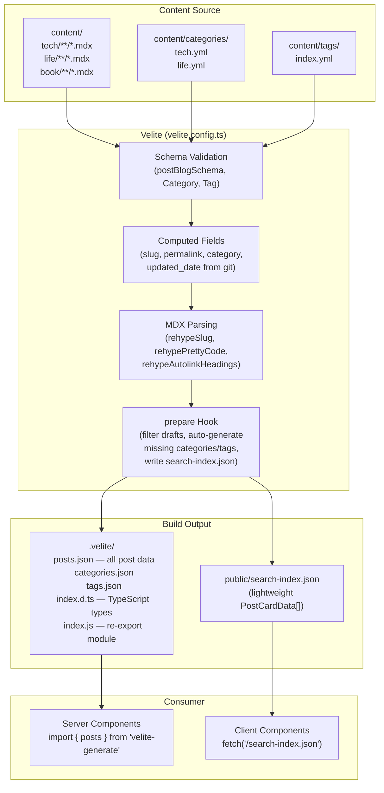

# Velite Content Pipeline

## Overview

Velite is the content layer that transforms MDX files and YAML definitions into type-safe TypeScript modules and JSON data. The pipeline runs during `yarn dev`, `yarn build`, and can be invoked separately via `yarn gen`.

## Pipeline Diagram



## Collection Definitions

### `posts` (PostBlog)

**Source pattern:** `**/*.mdx` (any MDX file under `content/`)

**Schema fields:**

| Field | Type | Description |
|-------|------|-------------|
| `title` | `string` (max 99) | Post title |
| `path` | `s.path()` | File path, auto-extracted |
| `date` | `s.isodate()` | Publication date (ISO string) |
| `updated_date` | `timestamp()` | Last modified date from `git log` |
| `author` | `string` (default `"Anxiu"`) | Post author |
| `cover` | `s.image()` (optional) | Cover image with blur placeholder |
| `description` | `string` (max 99, default `""`) | SEO description |
| `metadata` | `s.metadata()` | Auto-extracted: `readingTime`, `wordCount` |
| `excerpt` | `s.excerpt()` | First paragraph of content |
| `content` | `s.mdx()` | Serialized MDX as JS function string |
| `raw` | `s.raw()` | Raw markdown text |
| `toc` | `s.toc()` | Table of contents tree |
| `tags` | `string[]` (default `[]`) | Blog tags |
| `published` | `boolean` (default `false`) | Publish status |
| `draft` | `boolean` (default `false`) | Draft flag (hidden in production) |
| `comments` | `boolean` (default `false`) | Enable comments |
| `refLink` | `string` (optional) | External reference link |

**Computed fields** (via `.transform(computedFields)`):

| Field | Derivation | Example |
|-------|-----------|---------|
| `slug` | `<year>-<slugify(title)>` | `2025-ai-best-practice` |
| `created_date` | Same as `date` | — |
| `permalink` | `/posts/<slug>` | `/posts/2025-ai-best-practice` |
| `category` | First segment of `path` | `tech`, `life`, `book` |

**Validation:** `.refine()` ensures slug is never null.

### `categories`

**Source pattern:** `categories/*.yml`

| Field | Type | Description |
|-------|------|-------------|
| `name` | `string` (max 20) | Display name |
| `slug` | `s.slug()` | URL slug (reserved: `admin`, `login`) |
| `cover` | `s.image()` (optional) | Cover image |
| `description` | `string` (max 999) | Category description |
| `count` | `{ total, posts }` | Post count (auto-populated in `prepare`) |
| `permalink` | computed | `/category/<slug>` |

### `tags`

**Source pattern:** `tags/index.yml`

Same schema as `categories`, with `permalink` = `/tags/<slug>`.

**Currently defined tags:** Code, Python, Design-Pattern, Golang, Tool, Linux, MySQL, Docker, PostgreSQL, Deploy, Network, Paper, Research, Julia, Latex, Writing, GRPC, GRPC-gateway, Micro-service, Protobuf, Java, Agent, Economics, Literature (21+).

## MDX Processing

The `mdx` config applies these rehype plugins in order:

1. **`rehypeSlug`** — Adds `id` attributes to headings (enables TOC and anchor links)
2. **`rehypePrettyCode`** — Syntax highlighting with dual themes:
   - Light: `one-light`
   - Dark: `one-dark-pro`
3. **`rehypeAutolinkHeadings`** — Adds anchor links to headings with class `subheading-anchor`

### How MDX Content is Rendered

Velite compiles MDX to a serialized JavaScript function string. At runtime:

```
content (string, from post.content)
    → new Function(code)         (useMDXComponent in mdx-content.tsx)
    → fn({ ...runtime, ...React })  (pass react/jsx-runtime + React)
    → .default                    (the MDX component)
    → <MDXComponent components={sharedComponents} />  (render with custom components)
```

**Important:** The compiled MDX function is NOT standard JSX. It uses `react/jsx-runtime` for the JSX transform. The `MDXContent` component in `components/mdx/mdx-content.tsx` handles the runtime evaluation and component injection.

## The `prepare` Hook

Runs after all collections are processed. Handles:

```
1. Filter drafts        → posts where draft=true are excluded in production
2. Auto-create categories → any category found in posts but not in categories/*.yml
                           gets auto-created with counts
3. Auto-create tags      → any tag found in posts but not in tags/index.yml
                           gets auto-created with counts
4. Update counts         → recalculates count.posts and count.total for all
                           categories and tags
5. Write search index    → generates public/search-index.json as PostCardData[]
```

### `search-index.json` Structure

```typescript
// Type: PostCardData[]
{
  title: string;
  description: string;
  tags: string[];
  category: string;
  permalink: string;     // "/posts/2025-ai-best-practice"
  date: string;           // ISO date string
  readingTime: number;    // in minutes
  author: string;
}
```

## The `timestamp()` Custom Schema

Uses `git log -1 --format=%cd <filepath>` to get the last commit date for each MDX file. Falls back to `Date.now()` if the git command fails or returns empty.

## Path Alias: `velite-generate`

In `tsconfig.json`:
```json
{
  "paths": {
    "velite-generate": ["./.velite"]
  }
}
```

This allows importing from `.velite/` using the clean alias:
```typescript
import { posts, type PostBlog } from 'velite-generate'
```

## Consumer Patterns

### Server Component (SSR/SSG)

```typescript
// Direct import — full PostBlog type with all fields including content, toc, etc.
import { posts } from 'velite-generate'
import { getPostBySlug } from '@/lib/velite'

const post = getPostBySlug('2025-ai-best-practice')
// post.content → MDX function string → render with <MDXContent>
// post.toc      → TOC tree → render with <TableOfContent>
// post.metadata → { readingTime, wordCount }
```

### Client Component (CSR)

```typescript
// Fetch lightweight index — no MDX content, no TOC
fetch('/search-index.json')
  .then(res => res.json())
  .then((data: PostCardData[]) => { /* render or index */ })
```

**Rule of thumb:** Use `.velite/` imports in Server Components. Use `fetch('/search-index.json')` in Client Components. Never import `.velite/` in a `"use client"` file — it pulls the entire content into the client bundle.

## Adding New Content

1. Create MDX file in `content/<category>/<year>/<filename>.mdx`
2. Add frontmatter:
   ```yaml
   ---
   title: "My New Post"
   date: 2025-05-01
   tags: [Code, Golang]
   published: true
   draft: false
   ---
   ```
3. Run `yarn gen` to validate and regenerate
4. New tags/categories are auto-created in the `prepare` hook (no need to edit YAML)

## Adding New Categories or Tags (Manual)

To pre-define a category with a description or cover:

```yaml
# content/categories/new-cat.yml
name: NewCategory
slug: new-category
description: "Description of this category"
cover: /path/to/cover.png
```

Tags work similarly in `content/tags/index.yml` (single file with an array).

## Updating `.velite/` Output

**Never edit files in `.velite/` directly.** Changes should come from:
1. Editing source content in `content/`
2. Modifying schema/transform logic in `velite.config.ts`
3. Running `yarn gen` to regenerate

## Scripts

| Command | Description |
|---------|-------------|
| `yarn gen` | Generate `.velite/` and `search-index.json` |
| `yarn content:gen` | Alias for `yarn gen` |
| `yarn content:build` | Clean rebuild with verbose output |
| `yarn build` | Full build: Velite gen → Next.js build |
| `yarn dev` | Dev server with hot reload (Velite watches content) |
